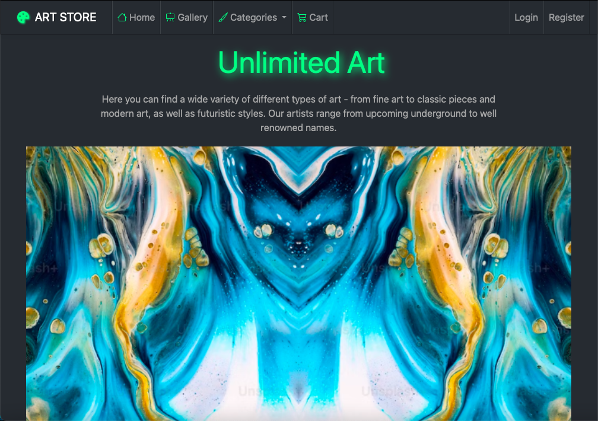
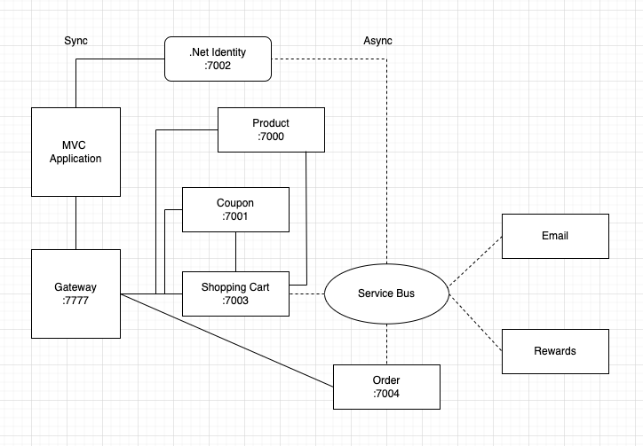

# Art Gallery with Microservices, Gateway and Cloud Messaging

## User Interface

---

## Description

A full stack art gallery application with microservice architecture and MVC design. It encompasses typical e-commerce functionalities, and utilizies a gateway to streamline access to microservices and enhance security management. Cloud messaging ensures reliability and asynchronous communication. The app has features such as role-based authorization, authentication, pagination, advanced search and filtering, coupon utilization, rewards, and Stripe checkout.

---

## Technologies used

- .Net Web API 
- .Net Identity
- Entity Framework Core
- Role Based Authorization & Authentication
- Async and sync communication between microservices
- Azure Service Bus - Topics and Queues
- Ocelot gateway
- Swagger 
- N-Layer implementation with Repository Pattern
- SQL Server Database
- Razor
- Bootstrap 

---

## Application Flow

